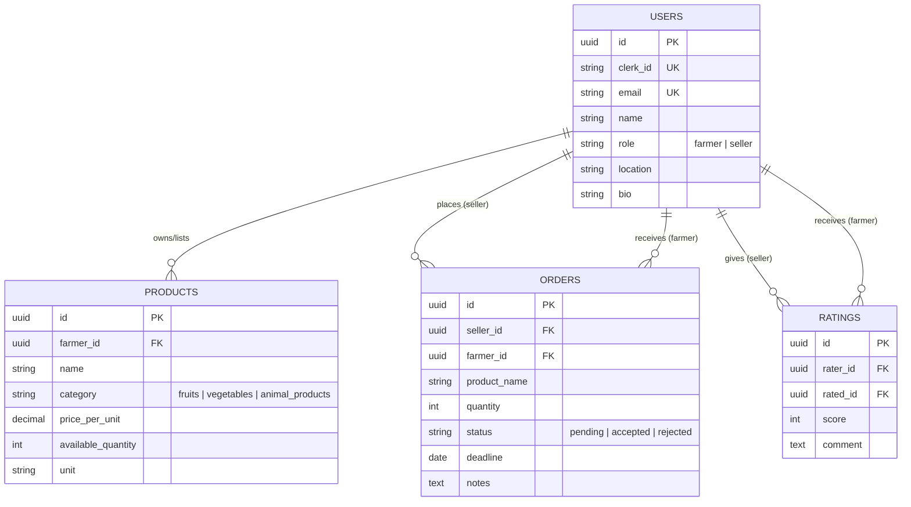

# 🌾 Agriconnect — Farm to Market, Simplified

Agriconnect is a premium digital marketplace designed to bridge the gap between farmers and wholesalers/retailers in Sri Lanka. It provides a high-end, responsive platform for farmers to manage their inventory and for sellers to source fresh produce directly from the source with verified trust.

---

## 🚀 Overview

This project streamlines the agricultural supply chain by providing a centralized, role-based platform. Whether you are a farmer in Nuwara Eliya or a wholesaler in Colombo, Agriconnect empowers your business with real-time data, secure transactions, and a robust reputation system.

---

## ✨ Features

### 🔐 1. User Authentication & Authorization
* **Role-based Access**: Custom dashboards and flows for **Farmers** and **Sellers**.
* **Secure Login**: Powered by **Clerk** for industry-standard authentication.
* **Onboarding**: Personalized setup collecting location, phone, and role-specific data.

### 🌐 2. Sourcing Network (Seller Dashboard)
* **Discover Farmers**: Browse a curated grid of verified farmers across the country.
* **Smart Filtering**: Filter by category (Vegetables, Fruits, Spices, etc.) or search by product/location.
* **Farmer Profiles**: View detailed bios, full product catalogs, and verified reviews from other buyers.

### 🌾 3. Product Management (Farmers)
* **Bento Dashboard**: Modern, card-based stats showing total inventory and active orders.
* **Inventory Control**: Add, update, and manage products with low-stock alerts.
* **Detailed Listings**: High-quality product representations with pricing per unit (kg, bundle, etc.).

### 🛒 4. Smart Order Management
* **Sellers**: Place orders with specific quantities and deadlines; track lifecycle (Pending → Accepted/Rejected).
* **Farmers**: Real-time order notification with "Accept/Reject" workflow to manage farm capacity.
* **Order History**: Comprehensive log of past procurements for both roles.

### ⭐ 5. Reputation & Review System
* **Verified Reviews**: Only sellers who have successfully transacted can rate farmers.
* **Star Ratings**: Interactive rating system (0–5 stars) with qualitative feedback.
* **Trust Badges**: Visual indicators for verified sellers and highly-rated farmers.

---

## 🛠️ Tech Stack

### Frontend
- **Framework**: React 19 (Vite 8)
- **Styling**: Tailwind CSS 4.0 (Modern CSS-first approach)
- **Typography**: Manrope (Headings) & Inter (Body)
- **Animations**: Framer Motion & Lucide React Icons
- **Auth**: Clerk React SDK

### Backend
- **Runtime**: Node.js & TypeScript
- **Framework**: Express 5.2 (High performance)
- **Database**: Neon PostgreSQL (Serverless / AWS East)
- **ORM**: Drizzle ORM (Type-safe migrations)
- **Validation**: Zod (Runtime type safety)

---

## 📂 Project Structure

```text
Agriconnect/
├── client/                # React Frontend (Vite + Tailwind 4)
│   ├── src/
│   │   ├── components/    # UI Kit (StarRating, Navbar, BottomNav, etc.)
│   │   ├── pages/         # Role-based views (Farmer/Seller/Onboarding)
│   │   ├── contexts/      # Auth & Theme (Dark/Light) state
│   │   └── utils/         # Axios API interceptors
├── server/                # Express Backend (TypeScript + Drizzle)
│   ├── src/
│   │   ├── controllers/   # Business logic & Route handlers
│   │   ├── db/            # Schema definitions & Drizzle config
│   │   ├── routes/        # API route definitions
│   │   └── middleware/    # Auth & Zod validation logic
└── README.md              # Project documentation
```

---

## ⚙️ Getting Started

### Installation

1. **Clone & Install**
   ```bash
   git clone https://github.com/your-username/Agriconnect.git
   cd Agriconnect
   npm install  # Install root deps (if any)
   ```

2. **Setup Backend**
   ```bash
   cd server
   npm install
   # Create .env with DATABASE_URL and CLERK keys
   npm run db:generate
   npm run db:migrate
   npm run dev  # Starts on port 5000
   ```

3. **Setup Frontend**
   ```bash
   cd ../client
   npm install
   # Create .env with VITE_CLERK_PUBLISHABLE_KEY
   npm run dev  # Starts on port 5173
   ```

---

## 🛣️ API Endpoints

| Category | Endpoint | Description |
| :--- | :--- | :--- |
| **Auth** | `POST /api/users` | Onboard user after Clerk signup |
| **Profile** | `GET /api/users/me` | Fetch personal profile data |
| **Farmers** | `GET /api/users/farmers` | Public list of verified farmers |
| **Products** | `GET /api/products` | Browse all products (Public) |
| **Inventory** | `GET /api/products/mine`| Get your farm's products (Farmer) |
| **Orders** | `POST /api/orders` | Place a new order (Seller) |
| **History** | `GET /api/orders/mine` | View your order history |

---

## 📊 Database Schema (ER)



---

## 🎨 UI Aesthetics
Agriconnect uses a **Premium Modern Design** philosophy:
- **Glassmorphism**: Subtle blurs and translucent card effects.
- **Micro-interactions**: Smooth hover transitions and button scaling.
- **Dark Mode**: Fully optimized dark mode for late-night farm management.
- **Responsive**: Mobile-first design with a dedicated `BottomNav` for smartphones.

---

## ⚖️ License
This project is licensed under the MIT License — © 2026 Agriconnect Team.
