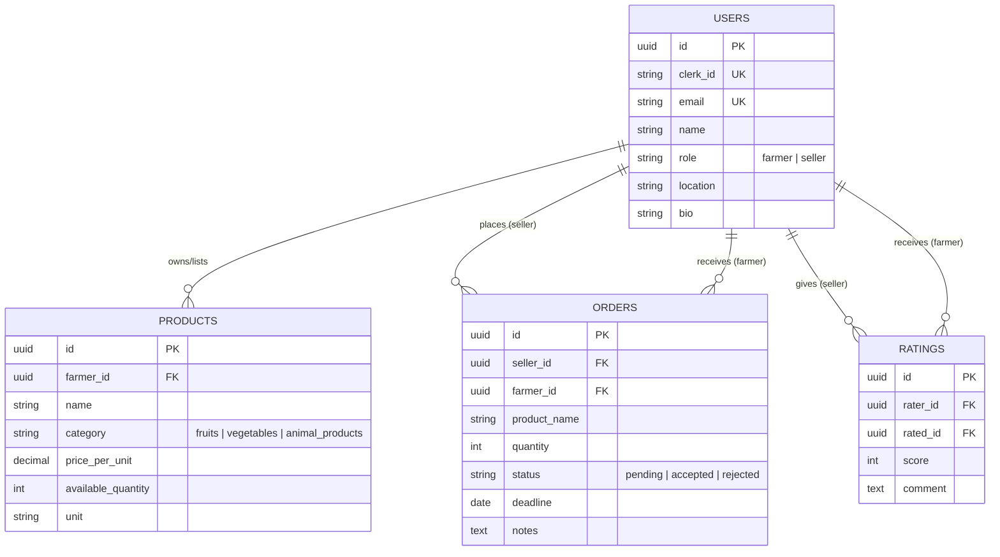

# 🌾 Agriconnect

Agriconnect is a digital platform designed to bridge the gap between farmers and sellers (wholesalers/retailers). It provides a streamlined way for farmers to list their products and for sellers to discover and order fresh produce directly from the source.

---

## 🚀 Overview

This project is built to solve the communication and logistics challenges in the agricultural supply chain. By providing a centralized marketplace, Agriconnect empowers farmers to reach more buyers and ensures sellers can find high-quality products efficiently.

---

## ✨ Features

### 🔐 1. User Authentication & Authorization
* **Role-based Access**: Separate flows for **Farmers** and **Sellers**.
* **Secure Login**: Integrated with Clerk for robust authentication.
* **Profile Setup**: Collects essential info like name, phone, and location.

### 👤 2. User Profile Management
* **Farmer Profiles**: Showcase product categories, listings, and reputation.
* **Seller Profiles**: Manage ordering history and preferences.
* **Public Profiles**: Sellers can browse verified farmer profiles.

### 🌾 3. Product Management (Farmers)
* **Inventory Control**: Add, update, and delete product listings.
* **Detailed Listings**: Includes categories (Fruits/Vegetables/Animal Products), pricing per unit, and available quantity.

### 🔍 4. Search & Discovery (Sellers)
* **Smart Filtering**: Search by category, product name, or location.
* **Farmer Feed**: A real-time view of registered farmers and their offerings.

### 🛒 5. Order Management
* **Sellers**: Place orders with specific quantities and deadlines; track status (Pending/Accepted/Rejected).
* **Farmers**: Receive real-time order requests and manage them via a dedicated dashboard.

### ⭐ 6. Reputation System
* **Ratings & Reviews**: Sellers can rate farmers (0–5 stars) and leave feedback.
* **Trust Score**: Average ratings displayed on farmer profiles to build community trust.

---

## 🛠️ Tech Stack

### Frontend
- **Framework**: React 19 (via Vite)
- **Styling**: Vanilla CSS (Modern design patterns)
- **Animations**: Framer Motion
- **Icons**: Lucide React
- **Auth**: Clerk React

### Backend
- **Runtime**: Node.js
- **Framework**: Express 5
- **Language**: TypeScript
- **Database**: Neon PostgreSQL (Serverless)
- **ORM**: Drizzle ORM
- **Auth**: Clerk Express / Webhooks (Svix)
- **Validation**: Zod

---

## 📂 Project Structure

```text
Agriconnect/
├── client/                # React Frontend (Vite)
│   ├── src/
│   │   ├── components/    # Reusable UI components
│   │   ├── pages/         # Application views
│   │   └── context/       # State management
├── server/                # Express Backend (TypeScript)
│   ├── src/
│   │   ├── controllers/   # Business logic
│   │   ├── db/            # Database schema & config
│   │   ├── routes/        # API endpoints
│   │   └── middleware/    # Auth & validation
└── README.md              # Project documentation
```

---

## ⚙️ Getting Started

### Prerequisites
- Node.js (v18+)
- Clerk Account (for Auth)
- Neon PostgreSQL instance

### Installation

1. **Clone the repository**
   ```bash
   git clone https://github.com/your-username/Agriconnect.git
   cd Agriconnect
   ```

2. **Setup Backend**
   ```bash
   cd server
   npm install
   # Create .env and add:
   # DATABASE_URL=...
   # CLERK_PUBLISHABLE_KEY=...
   # CLERK_SECRET_KEY=...
   # CLERK_WEBHOOK_SECRET=...
   npm run db:generate
   npm run db:migrate
   npm run dev
   ```

3. **Setup Frontend**
   ```bash
   cd ../client
   npm install
   # Create .env and add:
   # VITE_CLERK_PUBLISHABLE_KEY=...
   npm run dev
   ```

---

## 📊 Database Schema (ER)



---

## 🛣️ API Endpoints (Summary)

### 👤 Users
- `GET /api/users/profile` - Get current user profile
- `POST /api/users/register` - Register/Update user profile
- `GET /api/users/farmers` - List all registered farmers

### 🌾 Products
- `GET /api/products` - List all products (with filters)
- `POST /api/products` - Add a new product (Farmer only)
- `PUT /api/products/:id` - Update product details
- `DELETE /api/products/:id` - Delete a product

### 🛒 Orders
- `GET /api/orders` - List orders for the current user
- `POST /api/orders` - Place a new order (Seller only)
- `PATCH /api/orders/:id/status` - Update order status (Farmer only)

### ⭐ Reviews
- `POST /api/reviews` - Rate a farmer
- `GET /api/reviews/:farmerId` - Get reviews for a farmer


---

## 🧠 Future Enhancements (Phase 2)
- 📢 **Real-time Notifications**: Notify farmers of new orders and sellers of status updates.
- 💬 **In-app Chat**: Direct communication between buyers and sellers.
- 🌍 **Localization**: Support for Sinhala and Tamil languages.
- 📦 **Offline Support**: Optimized for rural areas with limited connectivity.

---

## ⚖️ License
This project is licensed under the MIT License.
